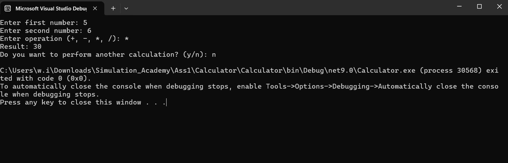

# Calculator

A simple calculator application built with C# and .NET.

## Features

- Addition
- Subtraction
- Multiplication
- Division
- Handles invalid input
- Handles division by zero
- Allows multiple calculations

## Technologies

- C#
- .NET

## How to Run

1. Open the project in Visual Studio.
2. Build the project.
3. Run the application.

## Example

```text
Enter first number: 10
Enter second number: 5
Enter operation (+, -, *, /): +
Result: 15


